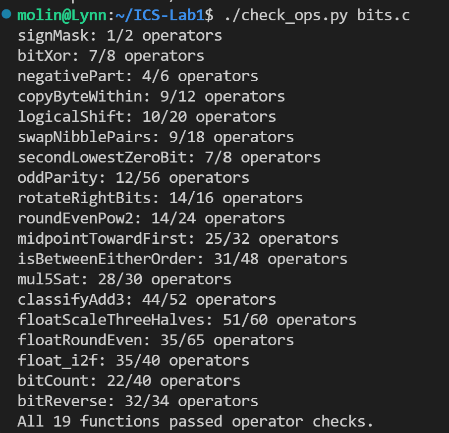
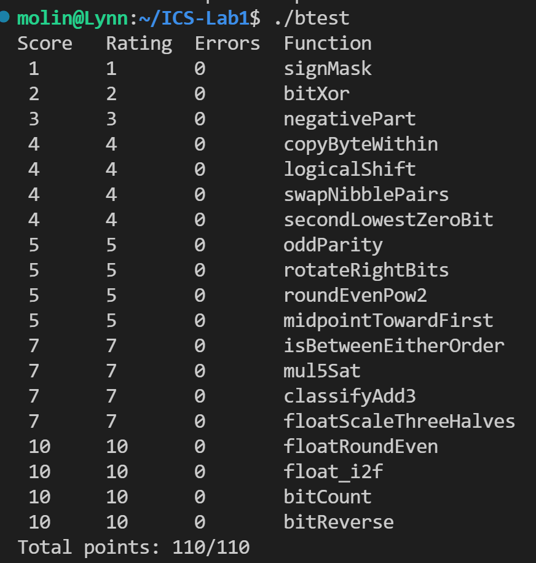

# Lab1: DataLab 实验报告

- 姓名：王墨林
- 学号：25803050111

## 一、验证截图

### 1. 操作符检查通过

### 2. btest 满分 110/110

## 二、解题思路

| 题号 | 函数 | 思路简述 |
|---|---|---|
| P1 | signMask | `1 << 31` 构造最高位掩码 |
| P2 | bitXor | 德摩根定律：`~(~x & ~y) & ~(x & y)` |
| P3 | negativePart | 算术右移 31 位取掩码，`(~x+1) & mask` |
| P4 | copyByteWithin | 移位提取源字节，掩码清零目标字节后合并 |
| P5 | logicalShift | 构造高 n 位为 0 的掩码清除算术右移符号位 |
| P6 | swapNibblePairs | 掩码 0x0F0F0F0F 分离高低 4 位后交换 |
| P7 | secondLowestZeroBit | 两次 `~x & (x+1)` 找最低和第二低 0 位 |
| P8 | oddParity | 折叠异或法（16→8→4→2→1）求奇偶 |
| P9 | rotateRightBits | 取模后逻辑右移与左移拼接 |
| P10 | roundEvenPow2 | 银行家舍入：加 `half-1+(q&1)` 后截断 |
| P11 | midpointTowardFirst | 无溢出平均 + 奇数时靠近 x 判断 |
| P12 | isBetweenEitherOrder | 两差值符号位异或判断是否在区间 |
| P13 | mul5Sat | 左移和加法溢出检测，溢出时饱和 |
| P14 | classifyAdd3 | 64 位拆分加法，看高位判断溢出方向 |
| P15 | floatScaleThreeHalves | 浮点拆解 + 3M 乘 + 舍入到最近偶数 |
| P16 | floatRoundEven | 按 E 分类舍入，中点取偶 |
| P17 | float_i2f | 求最高位、阶码、尾数，含舍入 |
| P18 | bitCount | 分治统计（2→4→8→16位合并） |
| P19 | bitReverse | 分治交换（1→2→4→8→16位） |

## 三、参考资料
- DataLab 文档

## 四、实验感受
通过本次实验，深入理解了补码、位运算和 IEEE 754 浮点表示，体会到用位运算实现复杂逻辑的技巧与乐趣。